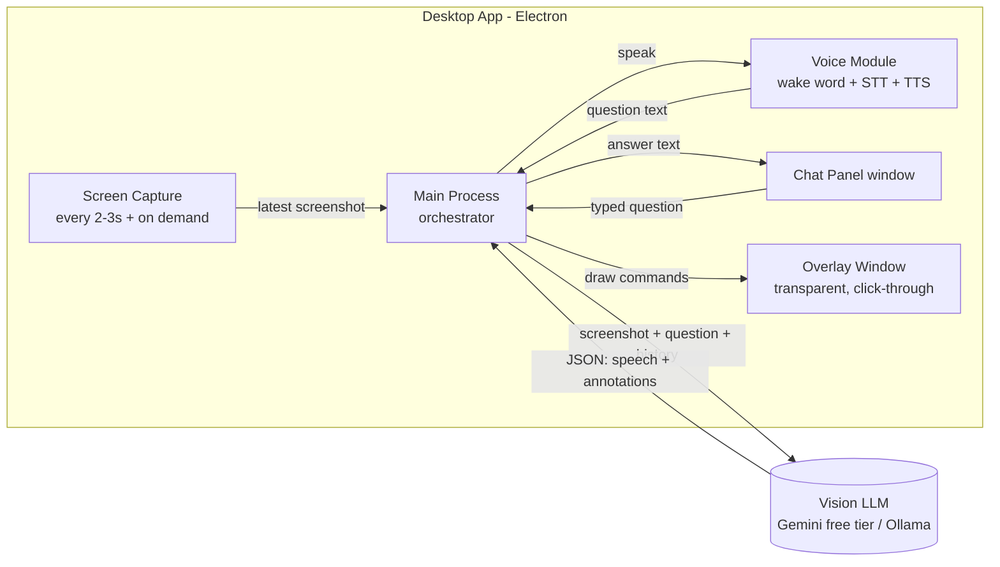

# Project "Friday": AI Screen Guide — Project Plan

A small desktop app that watches your screen, listens to your voice, answers your questions, and **points at and draws on your screen** to show you where things are and what they mean.

> Working name: **Friday** (the wake word). The main mode is called **Guide Mode**.

---

## 1. The idea

You start the app and switch on **Guide Mode**. From then on:

1. The app captures your screen regularly, like a private screen share.
2. You talk to it ("Hey Friday, I can't find the playlist section on YouTube") or type in a small chat panel.
3. It looks at the latest screenshot, works out the answer, and:
   - **speaks** the answer,
   - moves an animated **pointer character** to the right spot,
   - **highlights** the button (circle, box, or arrow),
   - shows the explanation in a **thought bubble**,
   - **clears the drawings** by itself once it has finished explaining.
4. A **Clear Screen** button and hotkey remove all drawings at any time.

**Example 1: YouTube.** You ask where your playlists are. Friday moves its pointer to the left sidebar, draws a circle around "You / Library", and says "Your playlists are under this section. Click here."

**Example 2: a log(x) graph on Google.** You ask "explain this graph". Friday points at the x-axis, then at the point (1, 0), then along the curve. At each stop the bubble explains what you are seeing: "The curve crosses zero at x = 1, because log(1) = 0…"

---

## 2. Website, mobile, or desktop?

**Build a desktop app.** Here is why the other options don't fit:

| Option | Can it watch the whole screen continuously? | Can it draw over other apps? | Verdict |
|---|---|---|---|
| Website | Only through a screen-share prompt, and only inside the tab | **No.** A web page cannot draw over YouTube in another window | ❌ |
| Mobile app | Heavily restricted by the OS | Very limited | ❌ |
| **Desktop app** | Yes, after a one-time permission | **Yes**, with a transparent always-on-top window | ✅ |

The key feature, drawing on top of *any* app, needs a **transparent, click-through, always-on-top overlay window**. Only a desktop app can create one.

You mentioned a DMG, so the plan targets **macOS first**. The same code also builds for Windows (.exe) and Linux later.

---

## 3. Recommended tech stack (free and simple)

| Layer | Choice | Why | Cost |
|---|---|---|---|
| Desktop shell | **Electron** | Plain JavaScript/HTML. It has built-in screen capture (`desktopCapturer`), transparent overlay windows, and global hotkeys, and it builds DMGs easily | Free |
| UI | Plain HTML/CSS/JS (React is optional) | Keeps the file count small | Free |
| Drawing overlay | HTML **Canvas** or **SVG** plus CSS animations | Easy pointer movement, circles, arrows, bubbles | Free |
| AI brain (vision + reasoning) | **Google Gemini API, Flash-tier model** (free tier) | Understands screenshots and can return **coordinates / bounding boxes** of on-screen elements | Free tier (rate-limited) |
| Offline alternative brain | **Ollama** with a local vision model (e.g. Qwen-VL, Gemma, or Llama Vision family) | Fully free and private, but needs a decent GPU or Apple Silicon | Free |
| Speech-to-text | **whisper.cpp** (local) *or* send audio directly to Gemini | Accurate and free | Free |
| Text-to-speech | Built-in `speechSynthesis` (uses macOS voices) → later **Piper TTS** for nicer voices | Zero setup | Free |
| Wake word "Hey Friday" | **Picovoice Porcupine** (custom wake words in its console, free personal tier) or **openWakeWord** (train a custom "hey friday" model with its free training notebook) | Runs locally and listens all the time cheaply | Free |
| Screen-text helper (optional) | **Tesseract.js** OCR, or macOS accessibility APIs | Makes pointing more precise | Free |
| Packaging | **electron-builder** | One command produces a `.dmg` | Free |

> Free tiers and model names change often. Check current limits at ai.google.dev before you start.

**Alternative shell:** **Tauri** produces a much smaller app (about 10 MB instead of about 150 MB) but needs some Rust. Start with Electron for speed and consider Tauri later.

**Note on the Web Speech API:** `webkitSpeechRecognition` does **not** work reliably inside Electron. Use Whisper or Gemini audio for speech-to-text instead. `speechSynthesis` (text-to-speech) works fine.

---

## 4. Architecture



### 4.1 Two windows

1. **Control/Chat window.** A small floating panel with the chat, a mic button, mode toggle, a pointer-skin picker, **Clear Screen**, and **Pause**.
2. **Overlay window.** Full screen, transparent, always on top, ignores mouse clicks (so you can still use your computer normally). All pointers and drawings live here.

```js
// overlay window essentials
const overlay = new BrowserWindow({
  fullscreen: false, ...screen.getPrimaryDisplay().bounds,
  transparent: true, frame: false, hasShadow: false,
  alwaysOnTop: true, focusable: false, skipTaskbar: true,
});
overlay.setAlwaysOnTop(true, 'screen-saver');
overlay.setIgnoreMouseEvents(true, { forward: true }); // clicks pass through
overlay.setVisibleOnAllWorkspaces(true);
overlay.setContentProtection(true); // tries to hide overlay from screenshots
```

**Important:** the AI must not see its own drawings in the screenshots. `setContentProtection(true)` usually excludes the window from capture. If it doesn't on your macOS version, hide the overlay for a few milliseconds while capturing.

### 4.2 Screen capture strategy (fast and free-tier friendly)

Sending a screenshot every second would burn through free limits quickly. Instead:

- The app **captures locally** every 2–3 seconds and keeps only the latest frame in memory.
- It **sends a frame to the AI only when**:
  - you ask a question (the main trigger), or
  - an optional "proactive tips" setting is on *and* the screen changed a lot (detected with a cheap image-difference check locally).
- Each image is **downscaled** to about 1280 px wide before upload.
- On Retina Macs, screenshot pixels differ from screen points, so the app must convert coordinates using `display.scaleFactor`.

### 4.3 The AI response format (the heart of the project)

The system prompt tells the model to reply **only with JSON** like this:

```json
{
  "speech": "Your playlists are in the left sidebar. Click 'You' to open them.",
  "steps": [
    {
      "action": "move_pointer",
      "target": { "box_2d": [120, 10, 160, 90] },
      "bubble": "Click here to open your library",
      "shape": "circle",
      "duration_ms": 3000
    }
  ],
  "auto_clear_after_ms": 2000
}
```

- `box_2d` = `[ymin, xmin, ymax, xmax]`, normalized to a 0–1000 range. Gemini is trained to output boxes in this format, which makes pointing reliable.
- The app converts the box into real screen pixels, animates the pointer there, draws the shape, and shows the bubble.
- Several `steps` in a row turn into a **guided tour**, as in the log(x) graph example.
- Speech playback and steps are synchronized. When the speech ends, the app waits `auto_clear_after_ms` and then **clears the overlay automatically**.

**Supported draw actions (v1):** `move_pointer`, `circle`, `box`, `arrow`, `underline`, `text_label`, `clear`.

### 4.4 Improving pointing accuracy

Vision models sometimes miss by a few pixels. The app adds precision in layers:

1. **v1:** trust the model's bounding box and draw a slightly larger highlight.
2. **v2:** run OCR locally (Tesseract.js). If the model says "the 'Library' button", the app snaps the pointer to the OCR word "Library" near the model's guess.
3. **v3 (advanced):** "Set-of-Marks" prompting. The app detects clickable elements (with OCR or macOS accessibility APIs), numbers them on a copy of the screenshot, and the model simply answers "element #14". This is the most precise method.

### 4.5 Voice pipeline

```
[Mic] → wake word "Hey Friday" (local, always on)
      → record until silence (VAD)
      → Whisper speech-to-text (local) → question text
      → AI (with latest screenshot)
      → speech text → TTS → speakers   (+ overlay animation in sync)
```

- **v1:** use **push-to-talk** (hold a hotkey such as `⌥ Space`). This is simpler and more reliable than a wake word.
- **v2:** add the "Hey Friday" wake word. No ready-made "hey friday" model exists, so create one: type the phrase into the Picovoice console (quickest) or train a custom openWakeWord model.
- **Future upgrade:** the **Gemini Live API** streams your voice and screen frames in real time and talks back with low latency. It could replace the whole STT/TTS pipeline, though it is more complex to set up.

### 4.6 Pointer skins (animated characters)

- The pointer is a small component with states: `idle`, `moving`, `pointing`, `thinking`, `talking`.
- Each **skin** is just a folder with images or a Lottie animation for each state, plus a `skin.json` file.
- Built-in skins: arrow cursor, glowing dot, friendly robot, and an original cartoon "professor" character with a thought bubble.
- **About Mr. Bean:** he is a copyrighted and trademarked character tied to a real actor, so don't ship him in the app. You can create your own original goofy character with the same "pointing and thinking" vibe. A skin folder lets you swap characters easily.

---

## 5. Modes

| Mode | What it does |
|---|---|
| **Guide Mode** (main) | Watches the screen, answers by voice and chat, points and draws |
| **Explain Mode** | "Explain what's on screen": a step-by-step tour of a chart, formula, or page |
| **Chat Only** | No screen capture; a normal assistant |
| **Paused / Privacy** | Capture stops instantly (hotkey), and a visible indicator shows it is off |

---

## 6. Controls and hotkeys

| Action | Default hotkey |
|---|---|
| Push-to-talk | `⌥ Space` (hold) |
| Clear screen (remove all drawings) | `⌥ C` |
| Pause/resume watching | `⌥ P` |
| Show/hide chat panel | `⌥ J` |
| Stop speaking | `Esc` |

---

## 7. Privacy and safety (important for a screen-watching app)

- **Everything you see is sent to an AI** when you ask a question. Free cloud tiers may use your data to improve their products, so read the provider's terms.
- A red **"watching" dot** is always visible while capture is on.
- **App blocklist:** capture skips password managers, banking apps, and private browser windows.
- **Nothing is stored on disk** by default. Screenshots live only in memory.
- For full privacy, use the **Ollama local model** option.
- API keys are kept in the OS keychain (`keytar` / `safeStorage`), never in plain files.

---

## 8. Project structure (small and simple)

```
friday/
├── package.json
├── electron-builder.yml        # DMG build settings
├── .env.example                # GEMINI_API_KEY=
├── src/
│   ├── main.js                 # app start, windows, hotkeys, orchestration
│   ├── capture.js              # screenshots, change detection, downscaling
│   ├── ai.js                   # prompt building, Gemini/Ollama calls, JSON parsing
│   ├── voice.js                # push-to-talk, Whisper STT, wake word
│   ├── coords.js               # box_2d → screen pixels (Retina, multi-monitor)
│   ├── preload.js              # safe bridge between main and windows
│   ├── prompts/
│   │   └── system.txt          # the "Friday" system prompt + JSON rules
│   ├── chat/
│   │   ├── chat.html
│   │   ├── chat.css
│   │   └── chat.js             # chat UI, mic button, clear, mode toggle
│   └── overlay/
│       ├── overlay.html
│       ├── overlay.css
│       └── overlay.js          # pointer animation, shapes, bubbles, auto-clear, TTS sync
└── skins/
    ├── arrow/    (skin.json + images)
    ├── robot/
    └── professor/
```

That is about **12 code files** for the full MVP.

---

## 9. Build roadmap

### Phase 0: Setup (½ day)
- Install Node.js and create the Electron project.
- Get a free Gemini API key at Google AI Studio.
- Grant macOS **Screen Recording** and **Microphone** permissions.

### Phase 1: Overlay proof of concept (1 day)
- Transparent click-through overlay.
- Hard-coded demo: the pointer flies to a coordinate, draws a circle, shows a bubble, then clears itself.
- The Clear Screen hotkey works.

### Phase 2: See and answer (1–2 days)
- Capture a screenshot and send it with a typed question from the chat panel.
- Parse the JSON response and draw the annotations.
- Test on the YouTube "where are my playlists" example.

### Phase 3: Voice (1–2 days)
- Push-to-talk → Whisper → AI → spoken answer.
- Sync the speech with the pointer steps, then auto-clear.

### Phase 4: Guided explanations (1 day)
- Multi-step tours (the log(x) graph example).
- Conversation memory (the last few questions and answers).

### Phase 5: Polish (2–3 days)
- Pointer skins and animations.
- Pause/privacy mode, app blocklist, and settings page.
- OCR snapping for better accuracy.
- "Hey Friday" wake word.

### Phase 6: Package (½ day)
- `electron-builder --mac` produces a `.dmg`.
- For personal use, an unsigned app is fine (right-click → Open the first time). Public distribution needs an Apple Developer account ($99/year) for signing and notarization. That is the only non-free step, and it is optional.

**Total:** about 1.5–2 weeks of part-time work for a solid MVP.

---

## 10. Cost summary

| Item | Cost |
|---|---|
| Electron, Node, Whisper, Tesseract, Piper, openWakeWord | Free |
| Gemini API free tier | Free (rate-limited) |
| Ollama local models | Free (uses your hardware) |
| Apple signing (only for public release) | Optional, $99/yr |

---

## 11. Risks and how to handle them

| Risk | Mitigation |
|---|---|
| Pointer lands slightly off target | Larger highlights, OCR snapping, Set-of-Marks (§4.4) |
| Slow responses (2–5 s) | Downscale images, show a "thinking" animation immediately, stream the speech |
| Free-tier rate limits | Send frames only when asked; keep a local fallback model |
| AI sees its own drawings | Content protection, or hide the overlay during capture |
| Retina / multi-monitor coordinate bugs | A single `coords.js` module with unit tests |
| Model returns broken JSON | Strict prompt, strip code fences, retry once, fall back to text-only |
| Privacy concerns | Pause hotkey, blocklist, local-model option, visible indicator |

---

## 12. Future ideas

- **Gemini Live API** for real-time, interruptible voice conversation.
- "Do it for me" mode, where the AI actually clicks (with confirmation each time).
- Record a lesson and replay it as a tutorial.
- Windows and Linux builds.
- A per-app knowledge pack (e.g. special tips for Excel, Photoshop, VS Code).

---

## 13. Suggested first prompt (system prompt draft)

```
You are Friday, a friendly on-screen tutor. You receive a screenshot of the
user's screen and a question. Reply ONLY with valid JSON, no markdown:
{
 "speech": "<short spoken answer, max 3 sentences>",
 "steps": [ { "action": "move_pointer|circle|box|arrow|underline|text_label",
              "target": {"box_2d": [ymin, xmin, ymax, xmax]},  // 0-1000 scale
              "bubble": "<short explanation shown near the pointer>",
              "duration_ms": 2500 } ],
 "auto_clear_after_ms": 2000
}
Point at the exact UI element or chart region you are talking about.
If you cannot find it, say so honestly and return an empty steps list.
Use multiple steps for explanations, in the order you speak about them.
```
